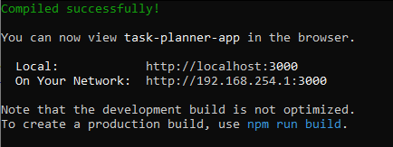
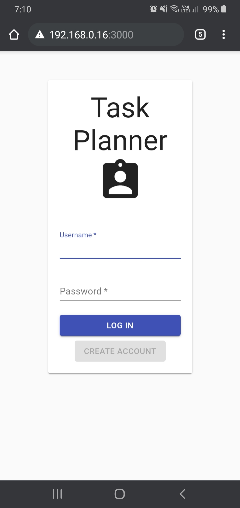
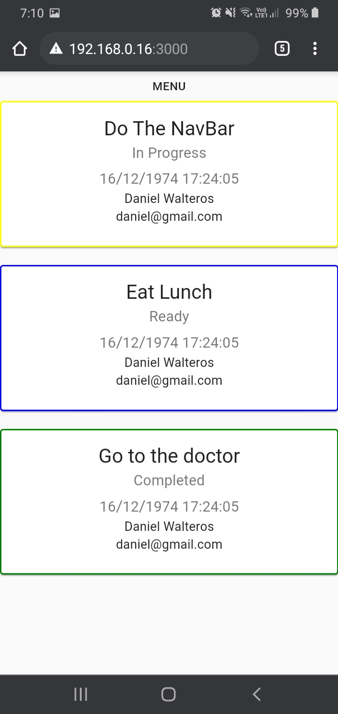
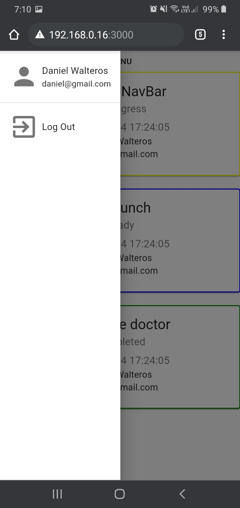

# IETI Laboratorio 3

Daniel Felipe Walteros Trujillo

[](https://walteros-ieti-lab3.herokuapp.com/

# Uso

1.  Clonar el repositorio.
2.  Usar el comando `npm install` para instalar las dependencias, al final se verá un resultado así.

    

3.  Usar el comando `npm start` para ejecutar la aplicación, por defecto se abrirá en la dirección `http://localhost:3000/` y verás lo siguiente en la consola.

    
    
    
    
4.  Para poder visualizar tener acceso a la aplicación primero debes autenticarte, esta autenticación solo se debe hacer una vez. Las credenciales básicas de acceso configuradas son:

        Email = daniel@gmail.com

        Password = 12345
    
    Una vez haces esto ves lo siguiente.
    
    
    
    Y haciendo click en la opción de menú obtendras la vista para desconectarte:
    
    

# Código de Honor
------
Debes seguir el Código de honor del ingeniero de sistemas para defender el estándar de integridad académica de la ECI:

- Tus respuestas a tareas, cuestionarios y exámenes deben ser tu propio trabajo (excepto para las tareas que permiten explícitamente la colaboración).

- No puedes compartir tus soluciones de tareas, cuestionarios o exámenes con otra persona a menos que el instructor lo permita explícitamente. Esto incluye cualquier cosa escrita por ti, como también cualquier solución oficial proporcionada por el docente o el monitor del curso.

- No puedes participar en otras actividades que mejorarán de manera deshonesta tus resultados o que mejorarán de manera deshonesta o dañarán los resultados de otras personas.

This project was bootstrapped with [Create React App](https://github.com/facebook/create-react-app).

## Available Scripts

In the project directory, you can run:

### `npm start`

Runs the app in the development mode.\
Open [http://localhost:3000](http://localhost:3000) to view it in the browser.

The page will reload if you make edits.\
You will also see any lint errors in the console.

### `npm test`

Launches the test runner in the interactive watch mode.\
See the section about [running tests](https://facebook.github.io/create-react-app/docs/running-tests) for more information.

### `npm run build`

Builds the app for production to the `build` folder.\
It correctly bundles React in production mode and optimizes the build for the best performance.

The build is minified and the filenames include the hashes.\
Your app is ready to be deployed!

See the section about [deployment](https://facebook.github.io/create-react-app/docs/deployment) for more information.

### `npm run eject`

**Note: this is a one-way operation. Once you `eject`, you can’t go back!**

If you aren’t satisfied with the build tool and configuration choices, you can `eject` at any time. This command will remove the single build dependency from your project.

Instead, it will copy all the configuration files and the transitive dependencies (webpack, Babel, ESLint, etc) right into your project so you have full control over them. All of the commands except `eject` will still work, but they will point to the copied scripts so you can tweak them. At this point you’re on your own.

You don’t have to ever use `eject`. The curated feature set is suitable for small and middle deployments, and you shouldn’t feel obligated to use this feature. However we understand that this tool wouldn’t be useful if you couldn’t customize it when you are ready for it.

## Learn More

You can learn more in the [Create React App documentation](https://facebook.github.io/create-react-app/docs/getting-started).

To learn React, check out the [React documentation](https://reactjs.org/).

### Code Splitting

This section has moved here: [https://facebook.github.io/create-react-app/docs/code-splitting](https://facebook.github.io/create-react-app/docs/code-splitting)

### Analyzing the Bundle Size

This section has moved here: [https://facebook.github.io/create-react-app/docs/analyzing-the-bundle-size](https://facebook.github.io/create-react-app/docs/analyzing-the-bundle-size)

### Making a Progressive Web App

This section has moved here: [https://facebook.github.io/create-react-app/docs/making-a-progressive-web-app](https://facebook.github.io/create-react-app/docs/making-a-progressive-web-app)

### Advanced Configuration

This section has moved here: [https://facebook.github.io/create-react-app/docs/advanced-configuration](https://facebook.github.io/create-react-app/docs/advanced-configuration)

### Deployment

This section has moved here: [https://facebook.github.io/create-react-app/docs/deployment](https://facebook.github.io/create-react-app/docs/deployment)

### `npm run build` fails to minify

This section has moved here: [https://facebook.github.io/create-react-app/docs/troubleshooting#npm-run-build-fails-to-minify](https://facebook.github.io/create-react-app/docs/troubleshooting#npm-run-build-fails-to-minify)
